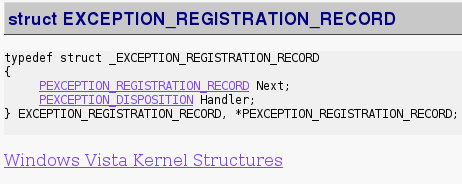
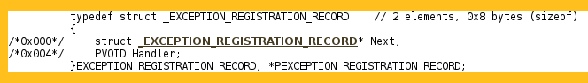
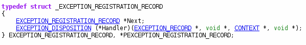

# cdef (formerly entitled PdbReader)


[](https://ci.appveyor.com/project/NoviceLive/cdef)


Recover C language structures from [Microsoft PDB] files.

Help us test this app!


## What it is

[PdbReader] is a software / software library
that recovers structure definitions,
which are of help in some low-level programming,
from [Microsoft PDB] files with resort to [DIA].

It's designed to be friendly to automation and further development,
see the dedicated section below on producers and consumers
for more information.


## For Users

It won't function without [DIA].
But if you have [Visual Studio] development environment installed,
it is most likely that you also have [DIA] installed.


### Demonstration

See http://librecrops.github.io/lost-sdk/.

But that's merely a demonstration of [PdbReader].

For further development upon structures
or any other customized requirements,
you'd better use [PdbReader] directly.


### Some Comparison

#### EXCEPTION\_REGISTRATION\_RECORD

The first structure of [NT_TIB](https://en.wikipedia.org/wiki/Win32_Thread_Information_Block).

[From NirSoft](http://www.nirsoft.net/kernel_struct/vista/EXCEPTION_REGISTRATION_RECORD.html).



[From MoonSols](http://msdn.moonsols.com/win7rtm_x86/EXCEPTION_REGISTRATION_RECORD.html).



[From PdbReader](http://hoocs.github.io/lost-sdk/files/EXCEPTION_REGISTRATION_RECORD.h.html).




### PdbReader.exe Usage

```
usage: PdbReader action file [args]

actions:
list    output types list
xml     output xml data
def     output type definitions
```

Explore and discover it yourself for the time being.


## For Developers

### Implementation Details

To be added later.

But now feel free to look at the source code in C#
as well as the [demo implementation](./CollectAlgorithm/demo.scm)
in the [Scheme] programming language.


### Producers & Consumers

PdbReader understands that [DIA] can't be made
cross-platform with ease, and therefore it will produce
an intermediate representation of structures using [XML].

That representation can be consumed in any programming languages
, as long as someone implements a consumer.

Our consumer in Python is currently under construction,
but it is of help when you want to write your own consumer.

Detailed specification of the representation may be added later.


[PdbReader]: https://github.com/kbridge/PdbReader
[Scheme]: https://en.wikipedia.org/wiki/Scheme_(programming_language)
[Microsoft PDB]: https://github.com/Microsoft/microsoft-pdb
[DIA]: https://msdn.microsoft.com/en-us/library/x93ctkx8.aspx
[Visual Studio]: https://www.visualstudio.com/
[XML]: https://www.w3.org/XML/


## Documentation

- [What the difference is between `()` and `(void)` and when it does matter](Documentation/()-vs-(void).rst)
[Scheme]: https://en.wikipedia.org/wiki/Scheme_(programming_language)
