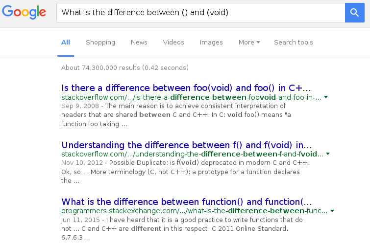

What the difference is between ``()`` and ``(void)`` and when it does matter
============================================================================

Part I. What the difference is
------------------------------

STFI
++++

And Google will tell you.

Recommended Readings
++++++++++++++++++++

- `c++ - What is the difference between function() and function(void)?`_

  Featuring references to both the ``C`` and ``C++`` standards.

- `Understanding the difference between f() and f(void) in C and C++ once and for all`_

  Featuring references to ``C99`` and ``C11`` standards.

- `Is there a difference between foo(void) and foo() in C++ or C`_

  Featuring simple explanation and the reference to ``K&R C``

Part II. When it does matter
----------------------------

Besides example scenarios in the aforementioned readings,
there still exist some circumstances where the difference has to be
taken into consideration carefully and seriously.

Case 1. Win32 API: CallWindowProc_
++++++++++++++++++++++++++++++++++

You know as usual, RTFM, CallWindowProc_.

Especially the section ``Remarks``, around the sentence
``This subtle distinction can break careless code.``,
deserves a serious reading.

Case 2. PdbReader_: Recovery of btVoid_ and btNoType_ in BasicType_ of DIA_
+++++++++++++++++++++++++++++++++++++++++++++++++++++++++++++++++++++++++++

In the very beginning
when encoutered with ``btVoid`` and ``btNoType``,
we didn't think of this difference,
notwithstanding the fact that we have understood
this difference several years ago before starting PdbReader_.

And before recognizing that ``btVoid`` corresponds to ``(void)``
while ``btNoType`` to ``()``,
we used ``__NoType__`` as a temporary placeholder for ``btNoType``,
which is, however, strange and incorrect.
As in `Issue #1`_, it's the ``PFNCLIENT`` structure from win32k.sys
that causes troubles.

Later, when our further investigation
on ``PFNCLIENT`` and ``WndProc`` led us to CallWindowProc_,
it suddenly occurred to us
that ``btNoType`` should correspond to ``()``.

Conclusion
----------

It's this very subtle and seemingly trivial distinction
that leads us to writing some wrong code and producing wrong results.
In fact, that's why we wrote this article and
curated a list of relevant materials,
which are intended to serve as takeaways for us
and precautions to others.

Simply put, keep the distinction in mind
and don't use ``()`` in ``C``, unless you are 100% confident
that you want the arguments unspecified,
which might be useful in some cases.

As a matter of fact, it very likely that there are still many more
situations where the difference can causing problems.

References
----------

- `c++ - What is the difference between function() and function(void)?`_

- `Understanding the difference between f() and f(void) in C and C++ once and for all`_

- `Is there a difference between foo(void) and foo() in C++ or C`_

- CallWindowProc_

- BasicType_

- `Issue #1`_

.. _c++ - What is the difference between function() and function(void)?: http://programmers.stackexchange.com/questions/286490/what-is-the-difference-between-function-and-functionvoid

.. _Understanding the difference between f() and f(void) in C and C++ once and for all: http://stackoverflow.com/questions/13319492/understanding-the-difference-between-f-and-fvoid-in-c-and-c-once-and-for-a

.. _Is there a difference between foo(void) and foo() in C++ or C: http://stackoverflow.com/questions/51032/is-there-a-difference-between-foovoid-and-foo-in-c-or-c

.. _CallWindowProc: https://msdn.microsoft.com/en-us/library/windows/desktop/ms633571(v=vs.85).aspx>

.. _PdbReader: https://github.com/kbridge/PdbReader

.. _DIA: https://msdn.microsoft.com/en-us/library/x93ctkx8.aspx

.. _BasicType: https://msdn.microsoft.com/en-us/library/4szdtzc3.aspx

.. _btVoid: https://msdn.microsoft.com/en-us/library/4szdtzc3.aspx

.. _btNoType: https://msdn.microsoft.com/en-us/library/4szdtzc3.aspx

.. _Issue #1: https://github.com/kbridge/PdbReader/issues/1
